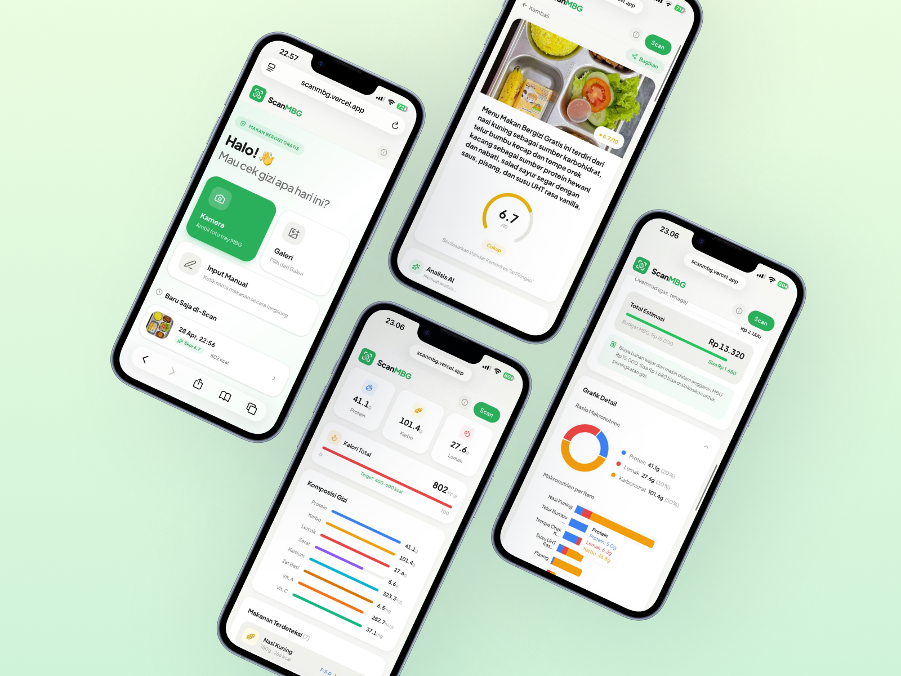

# ScanMBG

<p align="center">
  
</p>

<p align="center">
  <a href="https://scanmbg.vercel.app">Website</a>
</p>

<p align="center">
  
  
  
  
  
  
</p>

---

## Overview

ScanMBG is a web application for analyzing the nutritional quality of **MBG (Makan Bergizi)** meals. Users can scan, upload, or manually input their meals and receive structured insights including **nutritional breakdown, estimated price, and an overall MBG score**.

---

## The Problem

The MBG program has become controversial due to **low transparency and inconsistent reporting** of nutritional data.

In practice, some reported values are unrealistic. For example:
- Simple foods like *perkedel* being reported with **extremely high protein values**
- Menu pricing that does not match actual market conditions
- Lack of verifiable nutritional calculation methods

This creates a gap between **reported data vs real-world nutrition**.

---

## Solution

ScanMBG provides a **user-driven and reproducible evaluation system**:
- Uses **image or text input** instead of reported claims
- Applies **AI-based analysis** for consistent estimation
- Produces a **standardized MBG score** for easier comparison

---

## Features

- Image-based food detection (camera or upload)
- Manual meal input
- Nutritional analysis (calories, protein, fat, carbohydrates)
- MBG scoring system
- Price estimation
- Scan history (persistence)
- Shareable results (link + social preview image)

---

## System Pipeline

ScanMBG uses a multi-stage AI pipeline:

1. **Input Stage**
   - Camera capture
   - Image upload
   - Manual text input

2. **Image Detection**
   - Primary: Gemini 2.5 Flash  
   - Fallback: Qwen 3.5 (if rate limit or failure)

3. **Understanding & Structuring**
   - Extract detected food items
   - Normalize portion estimates

4. **Nutritional Analysis**
   - Powered by Qwen 3.5
   - Calculates:
     - Calories
     - Protein
     - Fat
     - Carbohydrates

5. **Scoring System**
   - Computes MBG score based on nutritional balance

6. **Price Estimation**
   - Estimates cost of the meal

7. **Output Generation**
   - Structured UI result
   - Auto-generated share image
   - Share links (WhatsApp, X, etc.)

---

## Tech Stack

- **Framework**
  - Next.js (JavaScript)

- **Styling**
  - Tailwind CSS

- **AI Models**
  - Claude Opus 4.6 — used during development (vibe coding & orchestration)
  - Gemini 2.5 Flash — image-based food detection
  - Qwen 3.5 — fallback detection + nutritional analysis, scoring, and price estimation

- **Other**
  - Persistent storage for scan history
  - Dynamic OG image generation for sharing

---

## Getting Started

First, install dependencies:

```bash
npm install
# or
yarn
# or
pnpm install
# or
bun install
npm run dev
# or
yarn dev
# or
pnpm dev
# or
bun dev
```
Open http://localhost:3000 in your browser to see the result.

Start editing by modifying app/page.js. The page auto-updates as you edit the file.

Deployment

The easiest way to deploy this app is using Vercel:

https://vercel.com/new

For more details, refer to the Next.js deployment documentation:

https://nextjs.org/docs/app/building-your-application/deploying

Repository

https://github.com/gnatnib/scanmbg
